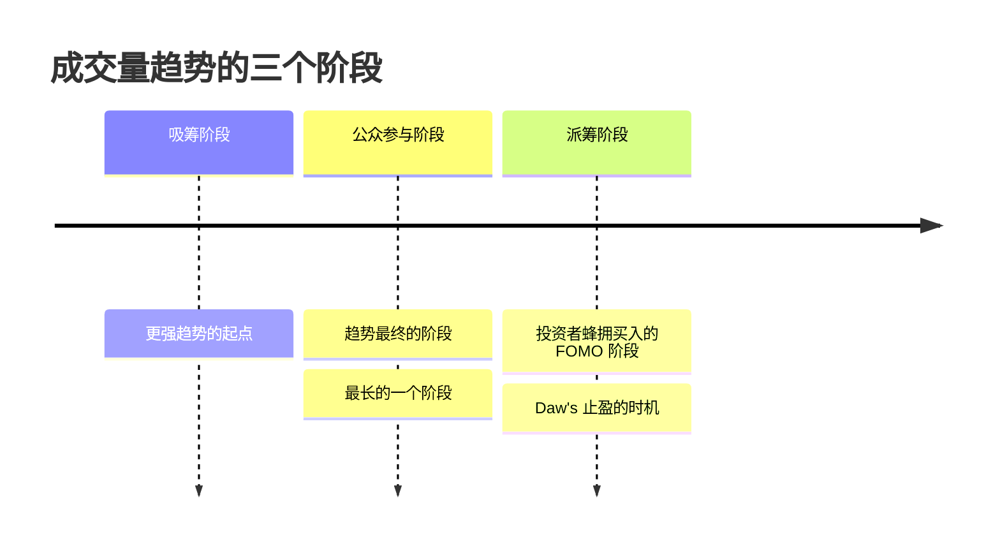
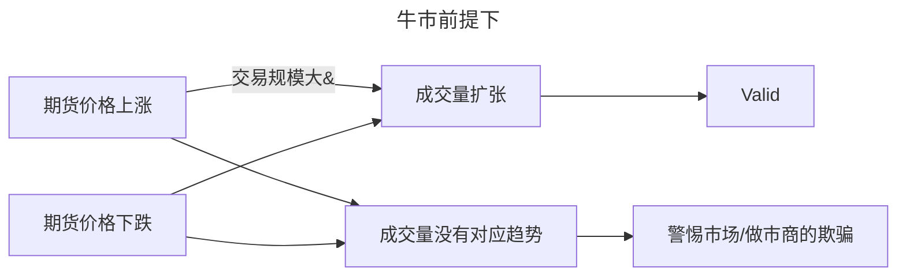
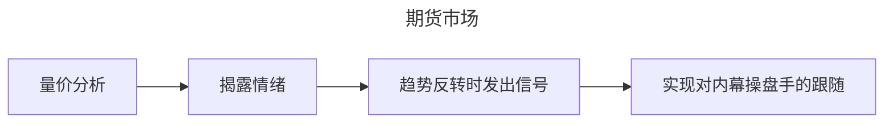

> [!summary+]
> 量价分析Volume Price Analysis，基于所有的金融市场都被幕后操作的假设，利用成交量是不可被隐藏和作假的特性，使用成交量来确认和预测价格运动。

## Intro 市场的基本行为

从威科夫量价交易之父提出的集散概念和价量至上原则开始："**价格和成交量是决定股价波动的最重要因素**"。此外查尔斯·道技术分析之祖的道氏理论中的一条基本原则也说"**成交量可以确定价格变化的趋势**"

>  因此进行相应分析时需要包含成交量和价格的图表。

From 《盘口解读》:

> 在根据市场自身的表现来判断市场的时候，短期波动或长期波动都由**价格**、**成交量**、[活跃度](活跃度.md)、[支撑位和阻力位](支撑位和阻力位.md) 所反映。从海里一滴水的成分可以推断海的成分，反之亦然；

### There is nothing new in trading. 适用性

**适用性：**“日光底下无新事”，目前可以认为基于成交量进行的量价交易，到今天仍然是适用的，且适用于各种市场（不同投资类型），各种交易或投资策略中。

### Daw's Rule 1 成交量确定趋势的有效性

Daw‘s ’Rule1：成交量可以**确定**价格变化的趋势；
Detail 具体而言：

- 当一个股票的波动伴随着较低的成交量，那么其变动的原因是多样且不能被确定的，其将不能被认定为存在一个有效的趋势；
- 而当一个股票的价格变动**伴随着很高的或者逐渐增大的成交量**，那么该变动是一个有效的变动，或者说，可以假设其具备构成一个趋势的基本条件（必要非充分）
- 在第二点的前提下，如果价格继续向着同一个方向变动，且拥有相应的成交量支撑，那么将是一段趋势开启的信号；

Expand 理论延续：当满足条件的趋势形成，Daw 认为接下来的趋势会具备一下的三个阶段（Daw 的趋势理论）：

理解一个趋势的不同阶段，对后续做出决策还是有所帮助的。

> [!Note]
> 成交量逐渐上升，是否就会形成一个供求关系的强烈变动，具体是如何 work 的呢？
> - 和流通量有什么关系？
> 买>卖 => 上涨？因此最好在第三阶段卖出？

>  股票指数的概念也是 Daw 提出的，通过行业指数等，可以追踪一个行业的整体状况从而了解宏观经济的运行情况；（大盘？）

### Wyckoff's 供需关系决定趋势

Wyckoff's Opinion：价格完全是由经济学中最基本的供求关系决定的，通过观察价格和成交年的关系，完全可以预测未来市场的方向。

>  他在对行业大师的采访中发现了共同点：行情纸带都是他们投资决策的依据，而行情纸带可通过其包含的信息：价格、成交量、时间、核心趋势来为我们揭示最基本的供求规律。

Three Basic Laws 威科夫的三大基本定律：

**一、供求定律：** 

当需求 > 供给时，为了满足这样的需求，价格会上涨；相反地，当供给 > 需求时，价格会下跌，结果就是超额的供给会被吸收；

**二、因果定律：**

有果必先有因，且因果之前呈现正比例相关，即：小规模的**成交量变化**将引起小范围的价格波动，重大的起因会导致重大的结果。

该因果定律并不只是指代变化规模上的，同样也能指代时间跨度上的，短时间图表上的成交量变化和长时间图表上的成交量变化，将会引导的是不同跨度和规模的趋势。

**三、投入产出定律：**

价格变动和成交量的变动呈现作用力和反作用力的关系，两者的变动应该有一种和谐统一的关系，即通过投入（成交量）即可预计相应的产出（相应的价格行为）。

分析每一条价格柱状图，看时候持续成立，如果是持续成立的，那么就可以继续适用该方法，进行预测，否则需要找到其背后的原因，分析异常，否则就不能在该股票上适用该方法。

---

简单的总结如下：在验证符合定律的情况下，关注异常疲软的需求或者异常强劲的需求，在供需适配的地方会发生相应水平的价格变动。

### Richard Ney 内幕交易永流传

"我们参与的投资市场或多或少的被操纵，包括做市商遮遮掩掩的行为，公开的一些政策干预等等"，但是成交量是无法被隐藏的，成交量反应交易行为，反应价格变化背后的真实情况，检验价格变动的真实性。

>  操纵：通过一些内幕消息和影响力（假消息等），来使得在各种交易中获利（根据自己的买入或卖出意愿来操纵价格），而不管股票的真实价值如何。

- [ ] 这里有个专业人士的卖空之道的八大法则，目前没明白意义在哪，可能能帮助我们理解操纵行为吧，后续补充

做市商的永恒存在可能也是对该点的一个佐证？[金融基本术语](金融基本术语.md)中参考做市商。

## Volume Matters 利用成交量跟随内幕

>  关键之处就在于获取比其他人更多的信息，然后正确地分析并使用他们 ——沃伦巴菲特

###  Get Info 通过成交量来洞察内幕者的操作

作为股票投资者，我们无法如同做市商一样获取市场的供给和需求水平，但是我们可以通过成交量间接了解这一情况，去间接的获取做市商的资讯。

这里**成交量分析具备局限性**：做市商会在交易发生数小时后才报告大众交易的数据，不过**仍然是我们窥探市场的最好工具**。

>  由于做市商对应的操作会影响该信息的时效性，因此可能会影响量化交易策略的执行，不过也可以考虑其中的价值和成交量的失配是否会带来一些新的信息。

无论做市商是否执行了某些操纵行为，成交量分析都是可以 Work 的，以下面这个分析为例：

在期货市场中，量价分析同样的也有验证价格变动真实性的能力，揭露市场中卖家和买家的真实情绪：

这里其实引出了量价分析的核心逻辑：

1. 假设内幕操盘者存在
2. 跟随内幕操盘者进行操作

在没有真实成交量数据的外汇现货市场，可以使用跳动点数据来做成交量的替代分析工具；跳动点可以按照拍卖报价来理解，报价跳动得越快，说明市场的成交量，活跃程度更高，情绪也更高涨。

>  外汇交易市场是内幕操作最多的市场，“汇率战争”这个术语就可以证明。

### Volume Rule 利用成交量的方式和基本准则

在使用成交量的时候，需要注意以下的三个方面：

- 成交量的**大小是相对的**：要考虑均值，也就是相对规模，相对性上的关系才是重中之重；
- 离开价格谈成交量是毫无意义的
- 时间也是关键因素之一，

下面有一个例子，后面再细细体会：

1. 当熊市中市场以较大角度向下运行，而价格如瀑布般暴跌，伴随着巨大成交量，这就是买入高峰；（此时散户由于恐慌大量抛售，而主力正在低价买入，这时对我们而言就是一个机会。）
2. 在牛市的顶点，我们发现成交量急剧放大，那么这就是一个抛售高峰。（主力向散户派发手中的股票，但是散户却认为价格就一步登天）
   
!! 此外作者认为，这是一个"酌情"做出决策的策略，因此**永远不具备自动化实施的可能**，这点我需要质疑一下，看下后面具体的执行方法。

> [!summary]+
> 对于投资者和投机者而言，研究成交量的原因是为了洞察内部人士，或者说专业人士的举动，跟随他们的方向。
