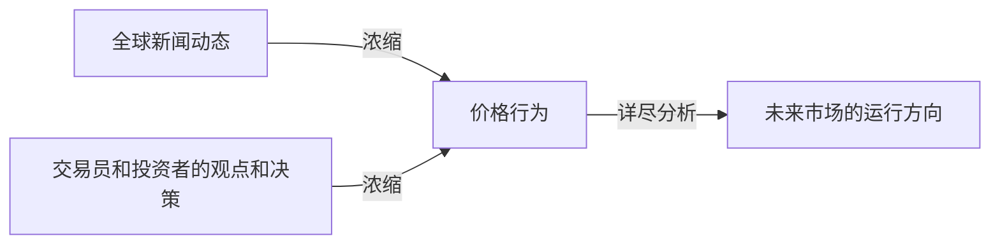
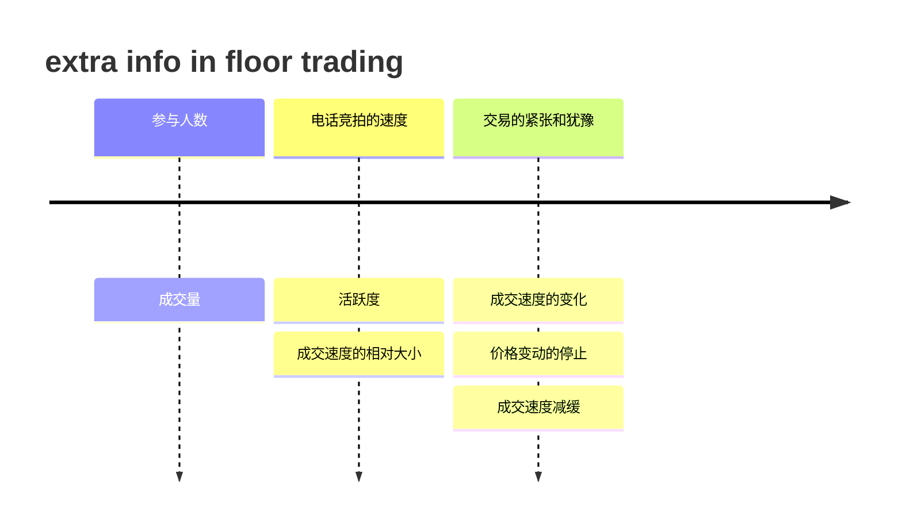
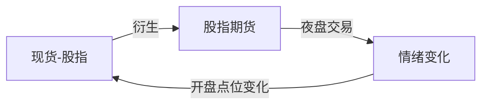
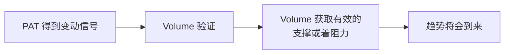
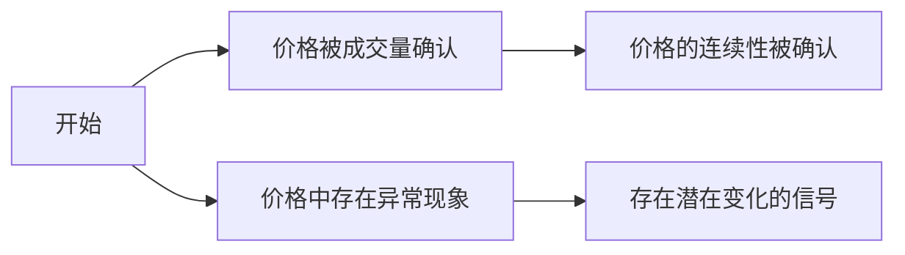
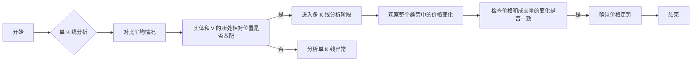

> [!Summary]
> 从交易员从场内到线上的转变为引，引出线上交易缺少对市场情绪的感知，因此需要通过成交量来补齐这一信息；此外以价格行为交易方法PAT Price Action Trade来介绍阅读 K 线的方法，并为后续的 VPA 做铺垫（PAT 方法实际上是 VPA 的一部分，只是没有做成交量的确认）

P.S：
- 美股绿涨红跌默认 A 股红涨吕跌默认，本笔记中暂时适用红涨，后续再做调整。
- 成交量本身没有颜色，颜色是为了区分当日的涨跌，和价值图表的颜色一致。

> [!todo]
> - [ ] 分析影线和实体的所有不同构成能反应的不同猜测
> - [ ] 每次遇到不同的 k 线图区间，最好介入自己的分析，来完善整个理论

## 场内交易到场外交易的失败

 场内交易员可以通过场内人的表现，来感受到**贪婪、恐惧；以及通过场内交易席位的买卖状况来判断市场的情绪**，这也就是所谓的"市场的气味"，场外线上交易缺乏了这种气味（信息）,仅凭借**价格行为**进行交易也导致很多交易员的转型失败。

不可否认的是：价格行为确实存在一些信息和作用如下：

但是在场内，可以通过观察得到以下的这些**额外的信息，其隐藏在表现之下**，能够帮助我们在价格行为至上，做出更加准确的决策，而不至于被市场欺骗，同时更加敏锐和有效：

而这些场内的一些额外信息，在在线交易时，可以通过以下的替代指标来感受市场的供求关系和情绪的发展变化。

- 成交量的相对大小
- 成交活跃度
- 成交速度的相对快慢
- 成交速度的变化（一阶导）

有真实情绪的市场和价格的变动相互印证，就可以避免被拍卖商（或者说是定价商，券商，做市商）的虚假竞拍（抬价）所欺骗，从而使得在合适的价格购入对应的商品。

换句话说，**再被操纵的市场中，成交量可以揭示价格变动背后的原因；而在未被操纵的市场中，成交量可以真实的反应市场的情绪和交易指令集。**

在 VPA 之前，我们先更深入的研究其中的 PA（T）price action trade

## PAT 价格行为交易

> 价格作为一个领先指标，它本身只能显示过去的事实，通过分析我们预测未来可能发生的情况，也许我们可以通过价格获得正确的预测，但是成交量可以让我们做的更加完整和可靠。

价格最重要的四个组成部分为：**开盘价**、**最高价**、**最低价**、**收盘价**； PAT 就要求通过这些数值的曲线，去感受情绪，一个典型的例子就是**开盘时价格的跳空**，开盘时价格突然远超或远低于前日价格，这能使得我们感受市场的强烈情绪。

但不得不提的是，随着全球电子交易系统带来的期货、**股指期货**的 24 小时交易制度，使得开盘价和收盘价的重要性没有以往那么重要（**特指具备股指期货的股票指数等**，对单只股票而言，其仍然受大盘和市场情绪的影响，还是很重要的），或者说重要性可以被夜盘的期货市场替代，其在**夜盘中的交易能使我们提前感受市场的情绪，因此开盘价的变化就不再使人意外**。

> 这种 24 小时交易会使得跳空变少或者情绪变化的表达更加含蓄/缺失，因此成交量的信息也愈发重要。

> [!idea]
> 是否可以利用夜盘的信息来从盘后交易中获利？

这并不意味着 PAT 就没有意义了，只是说相比于传统市场缺失了一部分信息，再次强调了成交量的重要性罢了，而要想读懂价格中仍然蕴含的信息，我们需要学会阅读 K 线图，k 线图中蕴含了价格的四大重要组成。

### K 线图的形态和基本阅读方法

>  在相应的时间框架内，每一个元素在分析价格行为时都起着相应的作用；另一方面，当我们适用成交量加以验证的时候，影线和实体最能揭示市场情绪。

### k 线图的基本元素

通过上图的形式，将 K 线图解读成一个正弦波，随着市场的上下震荡，买方和卖方争夺控制权的主导地位，在上涨形势中买方最终占据主导权，整个过程可能十分曲折，但是我们只需关注最终形成的趋势即可。接下来我们就需要从中阅读市场情绪：

一、**实体的长度/高低预示市场情绪的热烈程度**，高实体意味着情绪强烈，低实体意味着情绪低迷
二、**影线代表着变化，或者说是意见分歧**，因此影线的长度和含义，在量价分析中无比重要。

### k 线图中的实体和影线

> 正如上一小节中所说，实体长度象征市场情绪的激烈程度，而影线代表着具体变化过程；

实体而言：假如市场情绪始终都十分强烈且统一，那么我们将得到一个高实体且没有影线的 K 线图，这意味着市场始终向一个方向前进且没有质疑，该市场**情绪强烈且将持续**。

而**影线**由于其代表了变化和分歧，**其长度和含义在量价分析中是无比重要**的，下面有两个例子：

这是一个**不存在实体的下影线**，可以认为开盘后卖方占据了主导地位，力量超过了买方，导致价格下跌，随着价格下跌，对买方的吸引力上升，买方的力量逐渐压过了卖方，买家涌入市场，这意味着两点：

1. 无论周期多长，市场情绪出现了反转；
2. 收盘时市场处于看涨情绪中，这是由于买压暂时处于主导地位，（也有可能已经平衡？）

但是其并不能作为趋势反转的信号，因为仅凭借价格还没有足够的信息量，去判断当前买压的剩余力量是多少，还是已经达到平衡。如果需要得到这个信息，就需要分析在反转过程中发生了什么，这里就可以借助量价分析 VPA 中的 价量分布分析 VAP 即Volume at Price. 
 
> 通过在价格变动中的成交量变化，我们就可以基于成交量来衡量买压和卖压的大小，两股力量是否达到平衡，也能利用成交量的变化速度，变化加速度，即一阶导和二阶导，去评估这个力量的平衡价位等。(需要考虑市场是动态的，而不是不变的系统)

下面这个上影线的例子，和下影线的例子的分析是一样的：

1. 市场情绪出现了反转
2. 收盘时市场处于看跌情绪中

这种 k 线图可以是跳动点图上的，可以是五分钟、日线、周线，都是一样的，当我们在日线图和周线图上评估趋势，并在 1、5 分钟图上结合成交量去分析价格行为时，意义更大。

这两种 k 线图是非常重要的价格形态，后面还会反复回顾；目前在分析上还欠缺的是：

- 价格行为的强度，即上述说的是否达到平衡，可能需要借助 VAP 分析；
- 这种价格行为是否有效：即是否是真实的符合市场的价格运动。
- 后续如何发展。

这些就需要结合成交量去分析了。

## VPA 的基本原则

> [!summary]+
> 本章节并不是具体的分析技术和细节，而是涉及分析过程中的行动纲领，以及对整个方法的基本认知。

### VPA 是艺术并非科学

在量价分析中，我们要做的通常是如下的两点：

1. 对比分析价格行为和对应的成交量，寻找相互印证或者异常；
2. 对比历史成交量判断当前成交量的大小；

>  因此主要的成本是如何获取实际的成交量。

而在这个过程中，作者认为相互印证或者成交量的相对大小的判断，没有一个准确的标准，大部分的判断都是主观的，因此不具备主观能力的软件程序无法胜任量价分析的任务，**即 VPA 是艺术而非科学**。

--- 
但是考虑到当前 AI 技术的发展，无论是适用 DPO、强化学习、偏好模仿、还是针对单独的股票进行独立建模在使用 moe 进行统一分析，我认为都能模拟人类的主观偏好以及后续自我进化的特点，因此我认为其并非无法适用软件去替代进行决策。

就算对应完全替代的路线难度很大，适用软件去获取置信度较高，或者需要警惕的信号做保底策略来简化人类监管也是大有可为的。

### 耐心等待转变

>  金融市场犹如一艘巨大的游轮，他不会戛然而止又迅速启动，市场通常**拥有动量**；反转终究会到来，但不是在某根 k 线图发出信号后立即到来，在它准备好反转之前，将首先完成清理的工作。

**耐心原则**：当 K 线图形态预示潜在的反转或异常时，市场的趋势仍然会继续持续一段时间。

这可能也是量价分析会 Work 的原因：信号提前于趋势的发生，通过类似加速度正负转变的方式，在利用 delay 时间清楚原有势力或者说动量后，才实现趋势的反转，整个过程好比趋势曲线是 S，发展方向取决于 V，转变信号则是 a 的正负转换，示例如下：

> [!todo]
> 复习一下动量理论，可以参考动量的定律来对市场进行一个基本的建模，单纯考虑 S-V-A-t 的运动理论就类似 PAT，其中的成因 Volume 就好比 F=ma ，而作为 F 的 Volume 还能以动量的形式来对市场的运动产生影响，两者之间是能相互印证的。

回到具体的市场数值上而言，即从价格行为上看，买压或卖压在 Volume 和 Price 上的压倒性优势并非是瞬间形成的，而是一种逐渐转变的过程，通常可以看到下面这种流程：

1. 部分卖家坚信市场还会下行，继续坚持，市场下行了一小段后开始上行，越来越多的卖家离场
2. 市场再一次下行到更低点位后开始反弹，通过这种方式将固执的卖家清洗出局
3. 最后，清理完最后的卖家（"扫尾"）之后，市场做好了上行至更高点位的准备。

这种拉锯过程（犹豫情绪）正是一段**延伸行情**中的**价格震荡区间**的成因，在这种即将反转的情况下，通常会遇到**强力的支撑位**和**阻力位**；

>  是否包含如下的结构才是一个完整的趋势形成的信号?

### 成交量的核心在于相对性

由于我们**关注的是成交量的相对变化**，因此无需纠结于成交量获取的数据有多么的准确，但是**数据的一致性是十分重要**的，只要在我们分析的阶段数据的来源和统计方法是一致的即可。

这里通过作者的长时间实践和纠结发现是正确且可行的，一个**普通 MT4 平台的免费跳动点成交量数据**也能满足我们的需求，且其还是免费的，作者已经使用了多年。

### 熟能生巧

>  历久弥新的熟能生巧四字真言；保持耐心，投入时间和精力，数周或者数月后会发现自己有预测市场反转的能力。

上述提及，该方式适用于各种时间跨度的交易，因此在做实验的时候，可以：

1. 投资：从较长周期的日线图和周线图进行分析，寻找买入和持有的机会
2. 投机：适用跳动点图或者短时间周期图进行日内交易；

### 技术分析

量价分析只是技术分析的一部分，通常结合其他的工具和方式对我们的预测进行确认，其中最重要的就是上述提到的**支撑位和阻力位**，该指标能描述市场在反转之前进行扫尾工作的阶段，又或者只是一段长期趋势的停顿点，都可以在后续的成交量分析中得到验证，但价格突破整理区间，伴随着适当的成交量，常常是一个强烈的信号。

**趋势分析**、**价格形态分析**同样重要，都是技术分析的这门艺术的组成部分。

## VPA 的主要行为：确认或异常

量价分析实际上寻找的就是上述的两种情况，核心在于如何判断确认和异常，下面通过单一 K 线和多 K 线来介绍如何区分两种情况：

### 单根 k 线图：从微观出发

#### 价格确认信号

首先介绍价格被确认的例子：

**长阳线的例子**，根据上述 PAT 的理解，我们可以看出**价格强劲上涨**，**收盘价略低于最高价**，同时存在较高的成交量来匹配这一较大的价格变化（威科夫第三定律，投入产出匹配），由此价格被成交量确认，因此可以假设两种情况：

1. 价格的变动是真实的，未收到操控；
2. 市场处于牛市阶段，直到我们发现异常信号之前，都可以持有手中的长头寸；

**短阳线的例子**，这是一个伴随较低成交量的短阳线，具备幅度较小的价格变动（略微上涨），上影线和下影线也比较低，成交量也大幅低于平均水平，同样符合投入产出定义，较低的成交量促成较小的变动。（较低的投入只能促成较小的市场变动）。

#### 价格异常信号

接下来看下异常的例子：

**长阳线异常的例子**，其不符合威科夫的第三定律，有较大的价格变化（产出），但是仅有很少的市场参与（即成交量，即投入），这种异常出现时，我们需要考虑是否是市场或者做市商设下的多头陷阱。这种形态常常发生于：

1. 股票开盘，做市商基于夜盘中的信息判断市场的情绪处于牛市或熊市，然后通过抬高/降低价格来测试买家的兴趣，如果没有买家有兴趣，价格将会下跌，仅在买方会在高价进入市场时，他们才会继续抬高价格。后面再继续测试；通过这种方式来确定盘后九分钟的价格水平

因此**在开盘后的几分钟内盯紧图表，有助于我们明确当天的一个交易基调**，同时我们也应密切关注相关的突发行为，因为做市商"不会放过每一个制造危机的机会"，他们会通过新闻的机会来测试市场，根据新闻抬升或拉低价格，都有可能使得类似的图表出现。

这是一种标志且明确的陷阱信号，这种价格的上涨会迅速的发生反转，市场相反方向运动。

🔥 **短阳线异常的例子**，其同样不符合威科夫的第三定律，这里小幅度的价格变化却由着大量的成交量造成，这种典型的 K 线图形态往往发生于**牛市的顶部**，**或者熊市的底部**。是一种**市场趋于弱势的信号**。举个例子来分析：

> 假设：牛市情况
> 情形分析：持续了一段时间的上涨，主力多头开始了结利润，开始清仓卖出，而此时持有 FOMO 情绪的个人投资者拥入市场买入，此时由于主力在退出，个人投资者没有足够的能量来推动价格继续上涨，因此有大量的成交量却仅有较小的价格变动。此时买方仅稍胜卖方，但是如果趋势再往下后，可能也会出现反转，因为如果卖方十分坚定（强势）则会表现出阴线。
> 卖出对象分析：个人投资者通常存在追涨杀跌以及 FOMO 的特性，因此卖出的主要是了结利润的长期投资者，局内人，做市商，内幕交易者等；
> 剩余买家没法推动价格上涨，价格的上涨会引来更多的卖出，下跌则会有更多的买家，在该价位拉扯。

因此这是一个市场走弱，而挣扎于保持现有水平的一个典型信号，如果原先持有头寸，就应该收拾收拾卖出，或者准备在趋势反转的时候建立头寸。

#### 了解信号的趋势背景

> [!Summary]
>  在 k 线图的解读中，对所处趋势的认知影响解读的方向，趋势对于信号的解读是必不可少的环节即：**K线图在趋势中所处的位置不同具有的意义也不同**

趋势对 k 线图分析的影响主要有以下的几类：

- 时间跨度：信号是在 5 分钟图中，小时图，日图等发生的，对应的趋势周期和长度是不一样的，并非只有长期趋势才叫做趋势；
- 趋势中的位置定位：需要明确价格异常的信息具体引导向建立头寸还是卖出，需要借助趋势信息来明确我们在价格变动中所处的位置，

而要分析趋势，明确信号带来的引导，寻找潜在的反转点，需要使用**支撑位和阻力位、 K线图形态、单根K线图，以及趋势线**进行分析。上述工具可以为我们提供我们的“方位”帮助我们确认价格变动中我们所处的位置。

### 多根 k 线图：宏观分析，由点到线

#### 趋势确认信号

以下图为例，这是一个连续上涨的 k 线：价格逐日上涨，且实体也逐日扩大，同样的成交量也满足一样的规律，逐日扩大。

可以看出曲线上整体是符合威科夫第三定律的，较低的价格变化实体对应较小的成交量，同时较高的价格变换实体也具备更高的成交量的确认。从单线和多线上都印证了这是一个市场参与（受到了市场情绪和专业人士的共同支持）的正常价格变动，形成了一个成交量在增加的趋势的价格上涨趋势；

这里说明的是投入产出**不仅适用于单线，也适用于多线**的情况，这可以是我们进行**双重确认**；同时这里成交量和价格的变动也能用第二定律来解释即：此处结果的变动程度（趋势中的价格变动）和原因的规模（成交量在特定时间单位中的变动）是相关的，即上涨的价格与放大的成交量正相关。

假设上述的价格上升过程**没有影线**，我们可以认为，**成交量均为买入的成交量**（如果有卖出市场应该有所体现），市场坚定的上行，**是一个低风险的交易机会**。

无需赘言，下跌的例子也可同样使用威科夫第三定律来确认价格变动是否是有效的，与上涨和下跌无关，同样，我们从两个层次去确认价格变动的合理性。

> [!warning]
>  后续需要确认一下这个逻辑是否是正确的

#### 量价异常信号

以下图为例，价格在上涨，同时实体逐渐略微扩大，第一根 K 线的价格和成交量相互印证，但是其余 k 线却均有一些问题。

1. k 线图 2 中实体较低却伴随着巨大的成交量，这是市场弱势的信号，这意味着主要操盘手（做市商）正在卖出，因为大量的投入没有产生对应的上涨效果。
2. k 线图 3 是一个连续异常，在趋势上他实体相对于 2 更高，但是成交量却更低，这也清楚的印证了 k 线图 2 中的异常
3. k 线图 4 再一次异常，实体更高了，但是成交量却更低，该趋势中明确存在异常行为。

通过上述图的表现，可以有下面的结论：

首先 k 线图 2 中成交量的投入和价格产出的不匹配，体现了一个市场处于弱势的信号，市场处于"超买"的情况，做市商和专业人士感受到了市场的弱势，卖家享受做空机会，在这个点位大量卖出，等待价格下跌，同时继续**抬高价格来创造盈利而非推动上涨**，但是买方市场显然已经没有足够的能量推动价格继续上涨，下跌的成交量可以印证这一点，这是市场处于弱势的一个信号。

> **这也可能只是一个短暂停驻**，并非趋势的大型变动，进一步的我们需要**在更大的背景下分析图表**，决定我们看到的是一个小幅度的回落还是趋势改变的征兆。这一点上就需要**借助因果定律**，**从时间跨度和量的起因来分析**这是一个小幅度的回落还是一个大的趋势的转向。

这另一个**多根柱状图异常下跌**的趋势：价格持续下跌，实体逐渐扩大，成交量的变化却并不与之匹配，这里的分析和上述超买的情况类似，在第二个 k 线处开始发生异常。

同上述分析，可以有以下的结论：

k 线图 2 中低实体却对应的大量的成交，意味着市场拒绝向更低点位运动，**卖压正在枯竭**，做市商感受到了这个市场情绪，即越来越多的买家涌入开始买入，因此**做市商**在这一水平也开始执行买入，因此市场难以继续向更低点位运动，k3 和 k4 则是做市商继续调低价格，**试图欺骗卖方市场仍处于熊市，使其继续卖出，从而自己能在更低价位买入，建立头寸**。

由于做市商和专业人士转向了买方市场，从空头转向了买入，因此卖压开始枯竭，卖方不够支持成交量的上涨，来使得市场运行到更低的点位，因此也构成了一个信号。

**同样，有了这样的异常信号以后，我们还需分析进一步的信号，从因果定律出发，判断市场发生趋势反转的程度：是短暂回调还是大幅反转。** 

>  即使这是一个小插曲，也为我们提供了一个低风险的短期交易的机会。

至此，我们从**微观（单 K 线）出发**建立成交量的相对状态的感知，然后从**宏观分析（多 k 线）**，得到小级别的趋势，或者潜在的小级别反转的确认，而还**缺失的就是全局视角**，了解价格在这个长期趋势中的位置，这也是后面要介绍的内容

### 全局视角 Intro

>  我们从一根 k 线开始变焦到局部 k 线趋势，最终我们还需要看到更长时间上的大趋势，能够进一步的帮助我们理解市场运动，完善我们的局部分析，从而做出最终的决策，在这一部分，威科夫的第二定律：因果定律，就会大肆发挥作用。

#### 理解全局视角

正如**耐心等待转变**原则所言，市场并非是获取转向信号后就立即转向，从全局视角出发，我们可以知道这正是由于：

“市场就像一艘油轮——在局内人、专业人士以及做市商准备好前，市场需要花一定的时间消化买盘或卖盘以完成转向。在他们确认实施下一步计划之前，不希望市场成为他的阻碍。”

上述两个例子就像是"扫尾"行动，这种扫尾行动可能在日线图上会间歇性的持续在数天、数周、数月中出现，市场持续震荡整理，出现多次连续的反转信号，**来使得扫尾更加彻底，清楚市场的阻碍**，但是我们不知道合适反转会发生，而威科夫的第二定律告诉我们，当整理的时间越长，幅度越大，反转就越可能发生，准备的周期越长，最后转变的趋势也会更加持久。

以上述的例子而言，当我们发现这 4 个例子反复在同个价格水平出现，而非单次出现，那么就可能不是一个小插曲，而是一个较大的趋势了，在这种时候我们应该**耐心等候支撑位和阻力位的信号（后续）**。

#### 实际策略操作举例

（日内交易为例）：结合 5 分钟、15 分钟、30 分钟图表进行市场分析：

- 15 分钟图进行日内交易；
- 5 分钟图来获取靠近市场的视角；
- 30 分钟图来获取长期视角；

一个趋势如果在 5 分钟图中发生，随机传导到 15 分钟、30 分钟图中，那么他就会发展成为一个较为长期的趋势，（判断信号用多长的时间来蓄势？从而判断反转发生的趋势的持续水平？）

## FI
