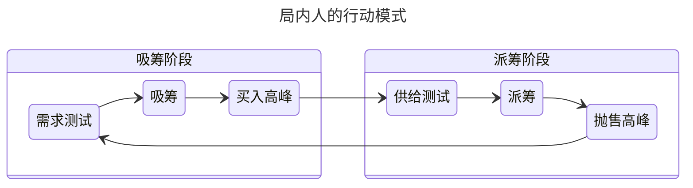

>  本篇中所有专业人士、做市商、大型操盘手、专业投资者都简单的称之为局内人/庄家，他们就是试图赚取股票的批发和零售差价的商人。于股票市场而言是专业人士、局内人和做市商，对于期货市场则是大型操盘手，而外汇现货市场仍是做市商。

> [!todo]
> 需要对各个阶段的具体表现做一下梳理，各个阶段我们到底希望能在 k 线图中看到什么形态。

## 量价分析的全局流程

前文中已经介绍了量价分析中的前两步，从最新的几条 k 线中获取异常或者反转信号，但还需要从全局趋势中获取当前信号发生所处的点位，从而对信号发生的实际和幅度有所估计，这也是本章要讨论的：**量价分析中的全局视角**。

> 要理解专业交易者的做法，投资者应该学会从一个试图以零售价格卖出手中股票存货的商人的角度进行思考，在他们清空货架上的存货的同时，出于盈利的目的，他们将以批发价格买入更多的商品，这是他们调整市场价格的首要目的。

在进行量价分析中全局视野的学习之前，首先要理解几个基本概念，或者说是商人的几个行动阶段/模式：

> 吸筹与派筹在所有时间跨度中无休止的循环往复，有大波动也有小波动,通过因果定律对每次吸筹和派筹的规模进行不同的分析。

- [吸筹阶段](吸筹.md)：庄家调整市场试图以批发价买入股票储备的阶段（具体查看吸筹部分的文档）
- [派筹阶段](派筹.md)：庄家抬高股票价格，以零售价卖出手上的筹码（股票储备）的阶段（具体查看派筹部分的文档）
- [供给测试阶段](供给和需求测试.md)：为了避免从吸筹阶段转向派筹阶段时，推高股价的过程中遭遇阻碍，卖家过多使得推高过程中价格下跌，需要从头开始吸筹，因此通过供给测试来判断市场上的卖家是否已经被消化，再推动市场进入派筹阶段。
- [需求测试阶段](供给和需求测试.md)：和供给测试一体双生，是为了准备从派筹阶段转向吸筹阶段的过程中，降低市场价格的过程中不会受到买压的阻碍，测试市场是否已经准备好走向下跌。

这样的吸/派筹阶段和需求/供给测试过程，就是我们在股市中需要寻找的重要信号，而且需要注意的是，**往往在吸筹或者派筹阶段以后会有多次而不是单次的测试**，一次比一次的成交量更低，当**价格突破**了这几次测试造成的**震荡区间**，就说明下一步行动（或者说我们期待的反转，将要到来了）

> 在理解抛售高峰和买入高峰的时候，需要注意的是这两个定义并不是针对市场的，而是指的是局内人操作中的买入和抛售高峰。此外在了解这两个概念之前，了解一下附录提到的问题可能对概念的理解有所帮助。

- [抛售和买入高峰](抛售和买入高峰.md)：在**吸筹和派筹最后阶段**的操作，用于清空最后的存货，此时的 k 线会呈现**长影线、低实体、高成交量的特点**。

总结一下这几个阶段可能会出现的一些特点：

| Stage |    Feature    |
| :---: | :-----------: |
|  吸筹   |               |
|  派筹   |               |
| 供给测试  |               |
| 需求测试  |               |
| 买入高峰  | 低实体、长上影线、高成交量 |
| 抛售高峰  | 低实体、长下影线、高成交量 |

- [ ] 整个局内人的完整工作流程就如下，但是我们需要更加清楚其如何吸引买家、卖家的入场，以及需要梳理一下各个阶段的特点。

> 这种周期可以存在于任意时间跨度和任意市场。上述情况可能出现于某一货币对的5分钟图中，可能持续数小时。同样，也可能存在于股票的日线图中，持续数周或数月。可能存在于期货合约的小时图中，这种情况下局内人将是大型操盘手，这一周期可能持续数天至数周。时间尺度并不重要，重要的是威科夫的“因果定律”

## 基本场景和概念辨析

这里对上述量化分析的全局视角中的一些情况做补充说明。

### 吸筹和派筹中的目标价值区间是如何确定的

> [!summary]
> 他们并不是提前计算好目标价值区间的值，而是局内人清楚每次市场震荡时，当前价格所处的位置，即是停滞或是要发生反转。

在任意的价格图表中，都会存在价格震荡区域，在这些区域中可以认为是一些超买或者超卖的时刻，在这种区域，市场要么在寻找阻力位，要么在寻找支撑位，他们共同定义了一道价值屏障，在这里趋势**要么延续，要么反转**；

局内人正是清楚这些区间所在的位置（是一个原先趋势的短暂停滞，还是一个新的趋势形成了），因此将这些区间作为天然的吸筹和派筹的区间。 

以一个派筹阶段为例，我们看抛售高峰中究竟发生了什么：

1. 市场本身上涨多时，随着利好信息的加速，市场进入目标区间，出现**超买/卖情况**中；
2. 开始行动：**正面消息支撑，牛市趋势上升，点位停滞派**筹；
3. 初始阶段为**自然阶段**：由局内人驱动的牛市动能自然而然的带动市场上升，成交量高（于平均值）但是不突出，该阶段局内人**仅需满足投资者和投机者的需求卖出**即可。
4. 后期的**抛售高峰**：为局内人**主要发力的阶段，市场非常弱势**，买方被卖方淹没，这时局内人需要不顾一切的支撑市场（利好消息等），甚至推高价格，并开始大量抛售。（他们的卖盘本身会使得价格下跌，为了市场不向不利的方向运动，做市商的努力最终就会导向那个 k 线图。）

还是一直反复说的，**大买盘或者卖盘都会直接对价格造成对自己不利的影响，因此需要隐蔽或者拆分成小笔的去进行**，也就是为什么行动会被分散在同一个时期的不同时间点。
## 附录 1 常见问题

### 为什么上涨总是比下跌需要更多的时间

从局内人的角度出发，，此外考虑到心理学的以下要素，可以知道太迅猛的涨跌和频繁的波动将会吓跑投资者，这并不是局内人乐意见到的。

- **贪婪与恐惧的不对称性**：投资者在盈利时倾向于逐步获利了结（导致上涨缓慢），而在亏损时因恐慌可能集中抛售（加速下跌）。行为金融学中的**损失厌恶理论**表明，人们对损失的敏感度远高于同等收益，这放大了下跌时的抛售压力。
- **预期形成机制**：上涨趋势需要持续的利好信息积累信心，而负面消息可能迅速摧毁市场共识。

因此局内人会通过缓慢的推高市场，然后逐渐加大脚步，使买家逐渐建立起信心，并产生市场具备向上的动量的错觉，由此来吸引买方；并且局内人也希望自己隐蔽自己的意图，一次性大量的成交会造成大量的价格波动，且会吸引注意，因此需要徐徐图之。

整个**上涨流程就是通过 FOMO 情绪**：上涨趋势开始加快步伐，价格逐级抬升，短暂停滞，小级别反转，吸引买方，同时引诱他人，然后继续上涨，直到接近派筹区域，其中因卖方了结利润所造成的小级别反转而小幅增加，帮助维持派筹行动最后一阶段的持仓水平。这正是市场在经历一系列更高的高点和低点、伴随短暂停滞和小幅回撤、继续上涨的原因。（因为有其余卖方的存在？）

而**更好的下跌方式就是制造恐慌**，利用厌恶损失的心里来造成大规模的连锁反应迅速下跌。

### 填满仓库和清空仓库一般需要多久

这个问题的答案就是**这些周期存在于任意时间跨度下**，从跳动点图，到1分钟图、 15分钟和60分钟图，然后到日线图、周线以及月线图。理解这一点的最好方法就是想想一个俄罗斯套娃：

- 首先，这些周期存在于所有时间跨度，其次，通过观察多个时间跨度下的价格行为，你将可以发现这些是如何形成、呈现以及相互间确认的。一个在1分钟图中已经开始的周期，可能会在5分钟图中慢慢显现，也可能在15分钟图中刚刚发展。

虽然这些阶段在所有的时间周期中都存在，但是从某种意义上讲，短期或长期的图表都能提供微观的、远视的视角以观察已经发生的事件。在分析中，**我们需要结合这两者，才能做出投资方面的理性决策**。

因此我们需要通过短或者极短的时间跨度下观察市场的微观结构，然后用更长的时间跨度来给予我们更宽广的视角来观察量价关系。再次强调，这些都是相对的，对于一个超短线交易者而言，这可能是5分钟、 15分钟或者60分钟图。而一个波段交易者可能会考虑60分钟、 240分钟和日线图。一个趋势交易者可能会使用4小时、日线以及周线图。

### 高频交易的策略类型

- 做市：与传统的做市行为一样，这一策略通过为市场双方提供流动性以此赚取差价从而获利。
- 套利：当套利机会出现时交易（例如：指数、交易型开放式指数基金以及美国存托凭证与它们各自基础资产间的错配定价）。
- 结构性策略：这些策略通过寻找从市场或者特定交易者的结构性弱点进而占取先机，包括潜伏套利和塞单交易。
- 方向性策略：这些策略试图抢在价格变动前，或者直接引发价格变动，包括指令占先和趋势引发。

### 市场操纵是否意味着局内人可以任意操控价格变动

局内人并不能任意操纵价格的变动，这里市场操纵的本质是通过引发投资者的恐惧与贪婪情绪来影响市场价格走势，而不是直接操控价格。局内人（如专业人士和做市商）无法垄断市场，他们只能协同作战并利用所有可用资源（如媒体新闻）来 manipulating 市场情绪，从而推动价格向其预期方向移动。成交量是确认局内人是否参与价格变动的关键指标，高成交量在买入或卖出高峰时会揭示他们的操作行为。