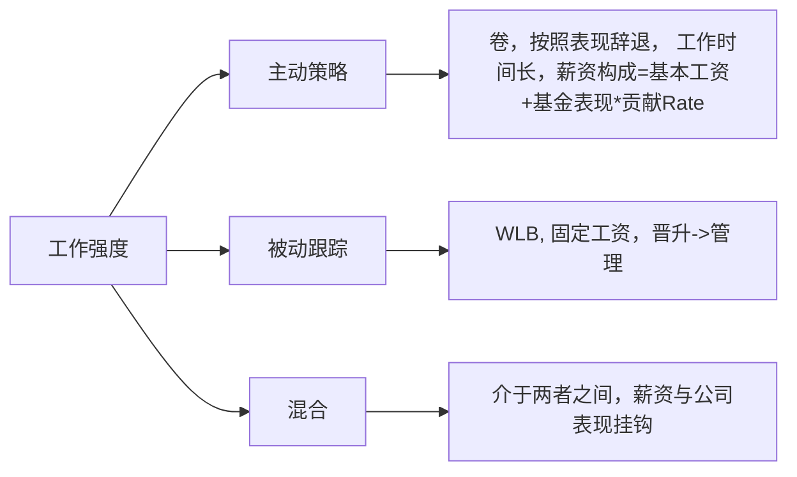
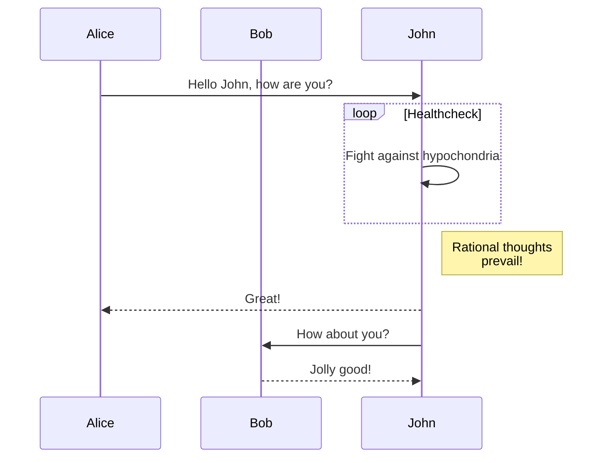
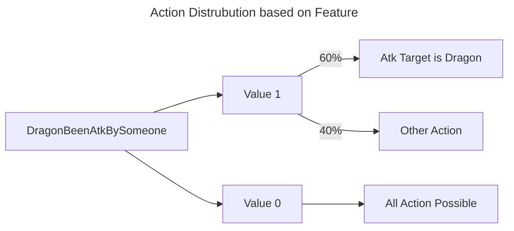

该文章会测试各种后续修改，包括基础字体，各种后续添加适配的shortcodes： 如 alert、视频、widget ，包括字体渲染，视频渲染，iframe渲染，以及相关的一些其他修改，
同时文章由于引入了大量的js，导致一些功能的渲染速度会下降，这也是我们需要测试的地方，包括找到加载的瓶颈；

## Alert Block 

接下来测试各个关键词的渲染效果并进行调整， 首先就是 Note

> [!note]
> test note block's style.

其次是：important

> [!important]
>  重要内容

接着是：tip

> [!tip]
> 这是一些提示内容

再次是 warning

> [!warning]
> 这是一些告警内容

最后是caution

> [!caution]
> 重要内容

然后测试一个自己添加的

> [!summary]
> 总结

## mermaid 

mermaid 的跟随主题切换更改渲染的方式一直不work，暂时使用black theme加渲染的方式做处理。

下面给出一个官方的不同实例来看不同的模式下的不同渲染情况

最后再来一个常规的流程图，或者说是概率图

## iframe

### gist



### ins



## pangujs

这是一段测试pangu之白的article，看看渲染出来的效果如何

## Videos

### bilibili

### youtube
