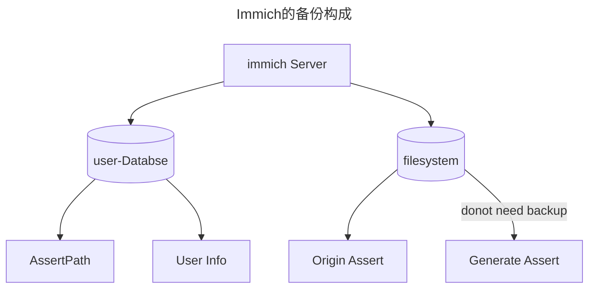
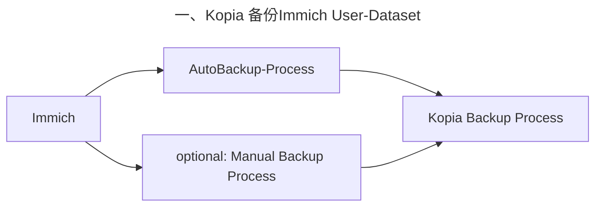
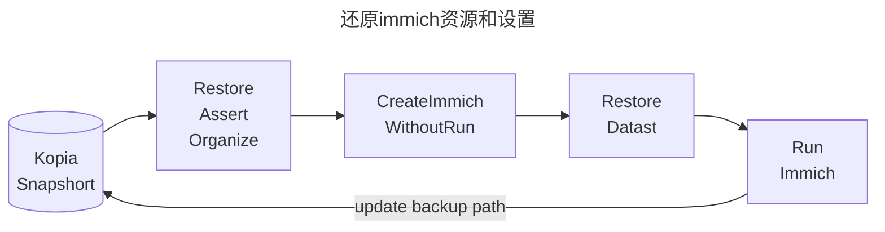

> [!Summary]+
>  前文中选择了 Kopia 作为笔者的备份工具，本文记录具体的备份执行方案以便后续查阅；

## 🌐 备份文件存储位置选择


基于笔者的现实条件约束，最终没有完全遵循 3-2-1 去管理自己的备份，而是利用 kopia 以如下的 2-1-1 作为替代：

- 2：除了原始数据，最终有 2 份分处不同位置的备份；
- 1：使用 kopia 在链接本机的移动 SSD 硬盘上存储第一份备份；
- 1：使用 kopia 和 Webdav 在阿里云盘上存储加密的第二份备份；

此处考虑类似阿里云盘的第三方服务本身做了备份处理，具备一定的容灾能力，因此使用第三方存储服务去做一个备份点就相当于将部分备份任务转嫁出去了。

而对于第三方网盘可能出现的数据泄露的担忧，由于 kopia 本身备份和上传的是加密的内容，无法被直接查看，相当于在平台外还添加了一层隐私安全的保险，不用担心隐私泄露问题。

## 📌 备份内容选择

### Immich 的备份和恢复



受限于 Immich 的机制，文件和用户的关联是在上传过程中建立的，对应的关联信息是存储在数据库中（上图的 user-Database） [backup-and-restore](https://immich.app/docs/administration/backup-and-restore/) ，如果仅对原始的 Assets 进行备份，**没有备份数据库的话，会导致无法将图片和账号进行绑定，就会需要重新对大量的图片数据重新走上传/外部库导入流程**；

重复的上传/外部库流程由于 1. 导入服务端原有的图片；2. 移动端设备的自动上传；会导致**出现大量的重复图片**，增加存储负担和查看体验；再加上其本身带来的**时间和性能消耗**，是非常得不偿失的。

如果不幸陷入了此等境地，上传建议使用**外部库** [External Library](https://immich.app/docs/features/libraries) 的方式来导入原有文件夹，这样可以迅速的对多个用户的多个目录去处理，然后等待其后台处理完毕；

#### 标准备份流程

言归正传，接下来分别介绍一下基于 Kopia 如何去实现一个正常的备份流程：



也就是说只需要在当天的**数据库备份之后启动 kopia 对 immich 的备份任务**即可，无论是定时的自动备份还是手动备份；

> 为了便于备份，新版本的 Immich 每天会自动生成数据库的备份到 `UPLOAD_LOCATION/backups` 目录中

手动备份的指令如下，执行手动任务的话可以使用 crontab 定时：

```bash
docker exec -t immich_postgres pg_dumpall --clean --if-exists --username=postgres | gzip > "/path/to/backup/dump.sql.gz"
```

二、备份完数据库后，仅需备份/恢复对应的**原始资源文件夹**即可，原始资源文件夹如下：

1. `UPLOAD_LOCATION/library`
2. `UPLOAD_LOCATION/upload`
3. `UPLOAD_LOCATION/profile`

具体不同类别的存放路径会基于是否开启了 `Storage template` 有一些细微的区别参见 [asset-types-and-storage-locations](https://immich.app/docs/administration/backup-and-restore/#asset-types-and-storage-locations)  

**也就是说，只需要在指定的系统备份时间之后，启动 kopia 备份，并包含上述提到的 4 个目录，即可实现对 immich server 的充分备份。**

#### 标准还原流程



简而言之，这里最主要需要注意的就是在构建 Immich 之后，正式运行之前，就需要执行数据库的还原，避免运行后和生成的新数据库出现键值等的冲突；

>  这里资产的位置还原可能没有说那么紧急，但是如果需要修改资产在 Upload_location 中的位置的话，可能需要手动对备份的数据库进行修改，不建议。

还原脚本如下：

```bash
docker compose down -v  # CAUTION! Deletes all Immich data to start from scratch
## Uncomment the next line and replace DB_DATA_LOCATION with your Postgres path to permanently reset the Postgres database
# rm -rf DB_DATA_LOCATION # CAUTION! Deletes all Immich data to start from scratch
docker compose pull             # Update to latest version of Immich (if desired)
docker compose create           # Create Docker containers for Immich apps without running them
docker start immich_postgres    # Start Postgres server
sleep 10                        # Wait for Postgres server to start up
# Check the database user if you deviated from the default
gunzip < "/path/to/backup/dump.sql.gz" \
| sed "s/SELECT pg_catalog.set_config('search_path', '', false);/SELECT pg_catalog.set_config('search_path', 'public, pg_catalog', true);/g" \
| docker exec -i immich_postgres psql --username=postgres  # Restore Backup
docker compose up -d            # Start remainder of Immich apps
```

上面注释掉的 `rm -rf DB_DATA_LOCATION # CAUTION! Deletes all Immich data to start from scratch` 这一行就是在并非初次启动 Immich 的时候执行时，如果遇到 Postgres 的冲突，才需要执行，通过直接删除数据库来还原初始状态。

恢复后记得修改自己的 Kopia 中 immich 的新路径。

### Docker Volume 的备份和恢复

[如何对Docker的volume文件在主机间迁移 | sealhuang's blog](https://sealhuang.github.io/migrate-docker-volume-from-one-host-to-another)

### Linkstack 的备份和恢复


## ⚙️ Kopia 设置

### Basic Setting 基础设置

- 设置备份时间和频率
- 其他的使用默认的即可

### Kopia 连接阿里云盘

要将阿里云盘作为 Kopia 的一个备份仓库，需要使用 Webdav 去使得 Kopia 连接阿里云盘，但是由于阿里云盘官方第三方服务包提供的 **Webdav 仅支持文件的读取，并不支持文件的写入**，因此官方的 webdav 服务无法满足该需求；

- 


因此需要使用开源的第三方服务来挂载阿里云盘，并通过第三方服务映射出来的较为完备的 webdav 功能来连接 kopia ，进而使其作为存储仓库；这里有较多的选择，可以自行查阅其他选择，此处笔者使用的是家庭服务中提及的 **[Alist](https://alist.nn.ci/zh/guide/webdav.html)**，下面简单介绍一下相关的参数配置：

```txt
基于ip的url: https://{ip}:{port}/dav/{specific_path}
基于domain的url: https://{domain}/dav/{specific_path}
基于二级域名alist的url: https://{domain}/alist/dav/{specific_dirctory_path}
```

账号和密码同 Alist 的登录账号名和密码即可