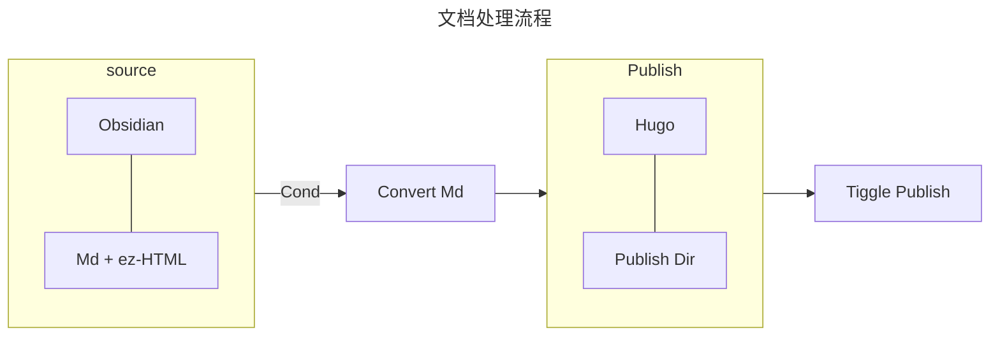

> [!important]+
> 本文为了避免 hugo 直接将 shortcode 渲染出来，在所有的 {{ 和 < 或 >，% 之间添加空格，具体使用的时候记得去掉。


## What's ShortCode in Hugo Mean 啥是简码

Hugo 中的短代码  后续用简码来表示  可以理解成一种使用固定方式引用的 Template(或者说 Alias)，通过使用**预先定义模版**，避免在 markdown 中直接添加大量 html 或者 go templates 代码

通常通过 `{{ < shortcode > }}` 的方式来调用模版，定义的简码可以为如下的三种形式：

|         type          | example                                           |
| :-------------------: | ------------------------------------------------- |
| Single-Word ShortCode | `{{ < year > }}`                                  |
| With-Params ShortCode | `{{ < img src="URL" title="Title" > }}`           |
|   Paired ShortCode    | `{{ < shortcode > }} content {{ < shortcode > }}` |

来支持不同类型的模版代码，将一些比较复杂的 html 代码通过简码的形式嵌入，可以使得我们的静态博客支持更多的拓展样式；[官方文档](https://gohugo.io/content-management/shortcodes/)

### Benefits and Limitation 利弊分析

> [!summary]+
> 简码存在什么好处和弊端，应该在什么时候使用简码，什么情况下定义为简码，什么时候将其定义为内置的渲染类型；

正如上文所说，ShortCode 其实本质上可以理解为 Hugo 内置的一种模版功能，通过**模版**用于在 Markdown 中快速的调用**额外**的样式，因此优势也就显而易见：

- 模版的角度：简化书写，具备良好的可重用性，统一管理；
- 拓展的角度：丰富样式，增强功能

例如我们可以使用简码为文章添加 sidenote(边注)，可以让文章的主体更加简洁，更为美观，效果如下：


虽然使用简码确实能够使得 blog 更加的美观，拓展一些额外的功能，但是相应的会使得本地软件编写时的**所见即所得的特性被破坏**，同时对文档或者说**博客平台迁移**的时候也会增加一些额外的工作量对文档进行处理；

>  当然这里也可以通过对一些开源的笔记软件进行适配去维持所见即所得的效果，但是工作量的增加是实打实的；

为此，退而求其次的，为了保持原 markdown 的可迁移的特性不要被严重破坏，同时能够较好的维持所见即所得的可以考虑使用一下的流程去处理<small> 笔者使用 Obsidian 编写文档</small>：



在源文件中尽可能的使用原生的 markdown 和一些简单的 html 去编写，然后触发转换脚本之后，根据各种不同的条件（例如发布平台）去进行 markdown 的转换（html 转换为短代码，或删除多余部分）并发布到对应的路径上去触发发布任务；

以边注为例，这里可以使用 `<small> content <small>` 在 Obsidian 中显示其脚注的特性，然后当发布到 Hugo 的时候，利用脚本将 `small` 转换为 `sidenote` 的形式即可，这里替换起来还是很简单的；

```python
import re
content = re.sub(r'<small>', '<sidenote>', content)
content = re.sub(r'</small>', '</sidenote>', content)
```

整体而言，笔者认为尽量少用那些比较特异的样式来破坏 markdown 的所见即所得的特性，但是可以通过这这种简单的 html 格式来保持的倒是无所谓，像是一些时间轴之类的，或者一些比较复杂的样式，建议还是少用，或者在一些场景将其转换为图片嵌入，主要的部分还是要让博客回归内容本身；

### Some Default ShortCode 默认简码

hugo 本身支持了部分的 ShortCode，这里简单列举记录，便于需要的时候调用，同时避免重复造轮子：

|  Name   | Example                                                                                                                 |
| :-----: | ----------------------------------------------------------------------------------------------------------------------- |
|  Gist   | [`{{ < gist spf13 7896402 > }}`](https://gist.github.com/spf13/7896402)                                                 |
|   Ins   | [`{{ < instagram CxOWiQNP2MO > }}`](https://www.instagram.com/p/CxOWiQNP2MO/)                                           |
| Twitter | [`{{ < twitter user="SanDiegoZoo" id="1453110110599868418" > }}`](https://x.com/SanDiegoZoo/status/1453110110599868418) |
| Youtube | [`{{ < youtube 0RKpf3rK57I > }}`](https://www.youtube.com/watch?v=0RKpf3rK57I)                                          |

这些具体的参数或者更多默认的一些 Shortcode 可以去[官网](https://gohugo.io/content-management/shortcodes/) 查阅，这里就不在多说。

### How To Design a ShortCode 编写简码

主要的流程如下，如果需要自己定义，建议还是去[官网](https://gohugo.io/templates/shortcode/)查看详细的文档、参数和优先级说明。

一、创建简码文件

在 Hugo 项目的 `layout/shortcodes` 中新建 `【keyword】.html` 文件，这里文件名的 keyword 会成为后续调用简码时的关键词；

二、编写简码文件

使用 Go template 和 html 编写你所需要的拓展样式，并通过 Go template 获取调用简码时传入的**内容和参数**进行处理和渲染；

下面简单列一些获取采位置参数，设定参数的写法：

```go
{{ .Get "class" }}
{{ .Get 0 }}
```

获取 Paired 中填写的内容则可以使用 `.Inner` 去获取，如下：

```go
{{ if strings.ContainsNonSpace .Inner }}
  Inner is not empty
{{ end }}
```

更多参数和内置变量和方法请参见官网文档和说明。

三、调用简码

使用 `{{ < keyword > }}` 或者 `{{ % keyword % }}` 的方式，或是上述提及的 paired 的方式进行调用。

## What I Support In My Website

> [!summary]+
> 本章节主要分享&感谢一些本博客中使用的短代码的来源，并简单介绍部分我修改或者编写的短代码，包括加密还有边注的短代码；

主题中引入的大部分 Shortcode 来自以下几位博主，这里简单整理了一下，这里就不再重复，如果需要的话可以转到博主的文章中查看，感谢几位博主的分享!!：

|                                 author                                  | shortcodes                                |
| :---------------------------------------------------------------------: | ----------------------------------------- |
| [荷载独彷徨](https://guanqr.com/tech/website/hugo-shortcodes-customization/) | 文字对齐、github 卡片、notice(两种)、quote(两种)       |
|       [Naive koala](https://www.xalaok.top/post/hugo-shortcodes/)       | Notice、隐藏内容、聊天气泡、时间轴、友联、块引用、bilibili、腾讯视频 |
|    [YC Photography](https://blog.imych.one/hugo-shortcodes-iframe/)     | iframe                                    |
|     [向着悠远的苍穹](https://kdjlyy.github.io/posts/site/hugo_shortcodes/)     | PPT、PDF、博客内链、代码折叠                         |

> 部分博主使用的是 Scss，使用的时候可以去网上搜索一下 Scss 转 css 的去转换成自己熟悉的格式，再根据自己主题的配色和习惯去简单调整一下 css 样式即可。

接下来介绍一下自己修改或者编写的一些简码，这里也分享出来供大家参考：

### Sidenote 边注简码

笔者希望博客能够充分利用视区的宽度，因此将 Papermod 的 Nav 和 Toc 都改到了侧边，但是通常使用宽屏阅读的时候，感觉还是有一部分空间没有被利用，决定通过简码支持 MarginNote  这里受[台运鹏]( https://yunpengtai.top/posts/hello-world/) 该博客的启发，感谢其分享   

最终参考 KF  [KF: Marginal Notes](https://kennethfriedman.org/thoughts/2019/marginal-notes/)   和 a Scripter  [Sidenotes using only CSS ❚ A Scripter's Notes](https://scripter.co/sidenotes-using-only-css/)   的实现，编写 hugo 的 shortcode，其核心就在于

- 使用 relative 和 float 进行 postion 控制
- 然后通过-值的 margin 来校准位置
- 考虑响应式的要素再去启用侧边注释，否则就嵌入正文中
- 使用 counter 做脚注

最终 shortcode 在本博客中呈现的效果和对应的 html 和 css 如下：


```html
<span class="sidenote-number"><small class="sidenote">{{ .Inner | markdownify }}</small></span>
```

```css
.sidenote {
  font-size: 80%;
  position: relative;
}
/* Wide viewport */
@media (min-width: 1500px) {
  .sidenote {
    float: left;
    clear: left;
    margin-left: -16vw;
    text-align: right;

    top: 0rem;
    width: 13vw;
    margin-top: 1rem;
    
    border-top: 2px solid rgb(0, 0, 0);
  }
  .dark .sidenote{
    border-top: 2px solid rgb(255, 98, 0);
  }
}

/* Sidenote counter */
main {
  counter-reset: sidenote-counter;
}
.sidenote-number {
  counter-increment: sidenote-counter 1;
  
}
/* Counter before the sidenote in the margin. */
.sidenote::before {
  content: counter(sidenote-counter) ".";
  position: relative;
  vertical-align: baseline;
  font-size: 0.9em;
  font-weight: bold;
}
/* Counter in the main body. */
.sidenote-number::after {
  content: counter(sidenote-counter);
  vertical-align: super;
  font-size: 0.7em;
  font-weight: bold;
  margin-right: 0.5rem;
}
@media (min-width: 1400px) {
  /* Highlight the sidenote when mouse hovers on the sidenote number in body. */
  .sidenote-number:hover .sidenote {
    -webkit-backdrop-filter: blur(30px);
    backdrop-filter: blur(30px);
    background-color: #ffffff7a;
    border-radius: 5px;
    font-weight: bold;
    padding: 5px;
    box-shadow: 5px 5px 10px rgb(25, 25, 25),
                -5px -5px 10px rgb(60, 60, 60);
  }
  .dark .sidenote-number:hover .sidenote {
    background-color: rgba(0, 0, 0, 0.5);
  }
}
.dark .sidenote-number small.sidenote,
.dark .sidenote-number small.sidenote a {
  color: rgb(255, 179, 0);
}
.sidenote-number + p {
  display: inline;
}

p:has(+ .sidenote-number) {
  display: inline;
}

```

也遇到了一些小问题：

> [!error]+
> counter 计数混乱

一开始使用 body 去做 counter-reset ，后续改为 main 去做 counter-reset 后就好，没有找到中间哪里触发了 body 的 reset，如果有了解的希望指点一二，感恩；

还有一些其他可以借鉴的 MarginNote 的实现如下，感兴趣的大家可以去看看：

- [Rongbin's Blog]( https://fanrongbin.com/blog-theme-changed/ )
- [Sidenotes in Hugo | dongheenam.info](https://dongheenam.info/posts/hugo-sidenotes/)

### Encrypt 加密简码实践

由于博客难免会写一些只想自己看或者说，只想和朋友分享的内容，因此在之前的 hexo 中支持了加密的功能，于是在 hugo 上找替代品的时候，目前发现的都是需要外部的代码|二进制执行，或是使用 submodule，这里为了更简单一些就尝试将其改为简码的模式；

参考 [Li4n0的hugo_encryptor](https://github.com/Li4n0/hugo_encryptor/tree/master?tab=readme-ov-file) 借助 Gpt4o 将其改为纯 html+js 的形式，由此实现利用简码对文章加密，效果如下：


但是这个方法的加密实际上是一个**伪加密**，存在以下的问题：

1. 一篇文章仅能加密一次，否则会使得密码出错;
2. 无法加密源文件，文章的内容仍能通过开发者模式中的源文件进行查看**未加密的 html**，只是无法直观的获取。
>  这是由于该脚本仅仅是对加载过程中的网页进行加密，但是对对应的 html 内容是没有加密的

这是由于 hugo 静态站点生成的本质，如果需要完全的加密的话，可能还是要考虑外部对生成的 html 进行处理，或者看能不能想办法干预 hugo 本身生成静态文件的过程，这里由于笔者本身对相应的技术栈还不是特别熟悉，因此暂且搁置。

这里还尝试了 [Li4n0的hugo_encryptor](https://github.com/Li4n0/hugo_encryptor/tree/master?tab=readme-ov-file) 和 [hugoArticleEncryptor](https://github.com/hotjuicew/hugoArticleEncryptor/blob/master/README-zh_CN.md) 都会对我的主题样式产生严重的影响，导致无法使用，如果有需要彻底加密的还是建议去参考他们的实现；

这里分享一下笔者基于 Li4n0 将加密过程改到 shortcode 中的代码如下，：

```html
<head>
    <!-- Other head elements -->
    <script src="https://mirrors.sustech.edu.cn/cdnjs/ajax/libs/crypto-js/3.1.9-1/crypto-js.js"></script>
</head>

{{ $_hugo_config := `{ "version": 1 }` }}
{{/*
    ## Hugo Encrypt
    ### Params:
    - `password`:
        require param
    - Simple
*/}}
{{/* DEFAULTS */}}

<div class="hugo-encryptor-container">
  <div class="hugo-encryptor-prompt">
    {{ if eq .Site.Params.hugoEncryptorLanguage "en-us" }}
      <p>Part of this article is encrypted with password:</p>
    {{ else }}
      <p>文章的部分内容被密码保护：</p>
    {{ end }}
  </div>
  <div class="hugo-encryptor-form">
    <input
      class="hugo-encryptor-input"
      placeholder='{{ if eq .Site.Params.hugoEncryptorLanguage "en-us" }}Please input the password{{ else }}请输入密码{{ end }}'
    />
    <input
      class="hugo-encryptor-button"
      type="button"
      value='{{ if eq .Site.Params.hugoEncryptorLanguage "en-us" }}Click to verify{{ else }}CLICK{{ end }}'
      onclick="_click_handler(this)"
    />
  </div>
  <div
    class="hugo-encryptor-cipher-text"
    data-password="{{ .Get 0 }}"
    style="display: none;"
  >
    <span style="display: none;">--- DON'T MODIFY THIS LINE ---</span>
    {{ .Inner }}
  </div>
</div>

<script>
    // This script should be included in your Hugo templates
// Make sure to include the crypto-js library in your HTML

function sanitizeContent(content) {
    // Remove unwanted characters (like control characters)
    return content.replace(/[\x00-\x1F\x7F]/g, '').trim(); // Remove control characters and trim whitespace
}

function encryptContent(password, content) {
    const key = CryptoJS.MD5(password).toString();
    const iv = key.substring(16); // Use the second half of the key as IV
    const paddedContent = padContent(content);
    const encrypted = CryptoJS.AES.encrypt(paddedContent, CryptoJS.enc.Utf8.parse(key), {
        iv: CryptoJS.enc.Utf8.parse(iv),
        mode: CryptoJS.mode.CBC,
        padding: CryptoJS.pad.Pkcs7
    });
    return CryptoJS.enc.Base64.stringify(encrypted.ciphertext);
}

function padContent(content) {
    const blockSize = 32; // AES block size
    const padlen = blockSize - (content.length % blockSize);
    // const padding = String.fromCharCode(padlen).repeat(padlen);
    // return content + padding;
    return content;
}

function processEncryptedBlocks() {
    const blocks = document.querySelectorAll('.hugo-encryptor-cipher-text');
    blocks.forEach(block => {
        const password = block.getAttribute('data-password');
        const content = block.innerHTML.trim(); // Trim whitespace
        const sanitizedContent = sanitizeContent(content); // Sanitize content
        const encryptedContent = encryptContent(password, sanitizedContent);
        block.innerHTML = encryptedContent;
        block.removeAttribute('data-password');
    });

    // Append the decrypt.js script
    const script = document.createElement('script');
    script.src = '/js/decrypt.js';
    document.body.appendChild(script);
}

// Call the function to process the blocks after the DOM is fully loaded
document.addEventListener('DOMContentLoaded', processEncryptedBlocks);
</script>
```

对应的样式设置如下

```css
/* change the style of the encrypt button & input */
/* only encrypt once in one posts. */

.hugo-encryptor-container:has(>.hugo-encryptor-prompt) {
    border-top: 2px solid black;
    border-bottom: 2px solid black;
    /* background: rgb(0 0 0 / 20%); */
    backdrop-filter: blur(5px);
    padding: 5px;   
    margin-bottom: 10px;
}
.dark .hugo-encryptor-container:has(>.hugo-encryptor-prompt) {
    border-top: 2px solid #5cbd63;
    border-bottom: 2px solid #5cbd63;
}

.hugo-encryptor-prompt {font-weight: bold;}

input.hugo-encryptor-input {
    border: 2px solid black;
    color: var(--primary);
}

input.hugo-encryptor-button {
    border: unset;
    background: black;
    border-radius: 20px;
    padding: 0px 5px;
    box-shadow: 0px 0px 2px 2px rgb(0,0,0);
    color:azure
}

input.hugo-encryptor-button:hover {
    background-color:#5cbd63;
    transition: 0.7s;
}

input.hugo-encryptor-button:focus {
    outline-color: transparent;
    outline-style:solid;
    box-shadow: 0 0 0 4px #5cbd63;
}

input.hugo-encryptor-input:focus{
    outline-color: transparent;
    outline-style:solid;
    box-shadow: 0 0 0 1px #0e0912;
}
.dark input.hugo-encryptor-input:focus{
    box-shadow: 0 0 0 1px #5cbd63;
}

.post-single:has(.post-content .hugo-encryptor-prompt) #toc-container{
    display: none;
}
```

此外当你有加密的需求，记得把你的 repo 改为 Private，不然图啥呢是吧🔒；

## FI

>  我可以不用，但是我得有啊，你说是不?